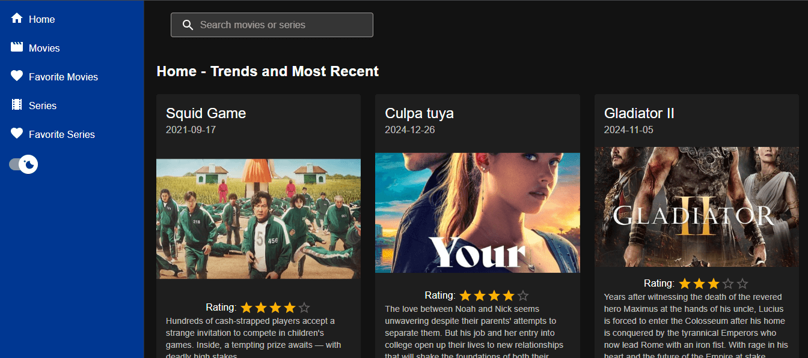

Movie Database Explorer

A modern, feature-rich movie discovery application built with React, TypeScript, and Material UI. Browse popular films, save favorites, and explore detailed information using data from The Movie Database (TMDB) API. Features infinite scrolling, dark mode, and a fully responsive design.

✨ Features
🎬 Movie Discovery: Browse popular movies with infinite scrolling for seamless exploration

⭐ Favorites System: Mark movies as favorites with persistent storage (localStorage)

🌓 Dark/Light Mode: Toggle between themes with system preference detection

📱 Fully Responsive: Optimized for desktop, tablet, and mobile devices

📜 Infinite Scrolling: Automatically load more movies as you scroll

🔍 Movie Details: View comprehensive information including ratings, overview, cast, and trailers

🎨 Modern UI: Clean, accessible interface built with Material UI components

⚡ Fast Performance: Efficient data fetching and caching strategies

🛠️ Tech Stack
Frontend
React 18 - UI library for building interactive interfaces

TypeScript - Type-safe JavaScript development

Vite - Fast build tool and development server

Material UI (MUI) - React component library for consistent design

React Infinite Scroll Component - Library for infinite scrolling functionality

Axios - HTTP client for API requests

React Router - Client-side navigation and routing

APIs & Services
The Movie Database (TMDB) API - Comprehensive movie data source

Browser LocalStorage - Persistent storage for user favorites and preferences

Deployment
Vercel (recommended) or Netlify - Frontend hosting platforms

🚀 Getting Started
Prerequisites
Node.js 18 or later

npm, yarn, or pnpm package manager

TMDB API key (free account available)

Installation
Clone the repository

bash
git clone <repository-url>
cd movie-explorer
Install dependencies

bash
npm install

# or

yarn install

# or

pnpm install
Environment Configuration
Create a .env file in the root directory:

env

# TMDB API Configuration

VITE_TMDB_API_KEY=your_tmdb_api_key_here
VITE_TMDB_BASE_URL=https://api.themoviedb.org/3
VITE_TMDB_IMAGE_BASE_URL=https://image.tmdb.org/t/p
Note: Get your free TMDB API key at The Movie Database Developers Portal

Run the development server

bash
npm run dev

# or

yarn dev

# or

pnpm dev
Open http://localhost:3000 in your browser.

Building for Production
bash
npm run build
npm run preview
📱 How to Use
Browsing Movies
Scroll down to automatically load more movies using infinite scrolling

Click any movie card to view detailed information

Use the search bar to find specific movies (if implemented)

Managing Favorites
Click the heart icon on any movie card to add/remove from favorites

Favorites are saved locally and persist between browser sessions

Access your favorites through the favorites page or section

Theme Switching
Toggle between dark and light mode using the theme switch in the header

Theme preference is automatically saved and applied on subsequent visits

Movie Details
View comprehensive information including:

Movie overview and synopsis

Release date and runtime

Average rating and vote count

Genre tags

Cast and crew information

Trailers and video content (if available)

🔧 API Integration
This project uses the TMDB API v3 to fetch movie data. Key endpoints include:

🌐 Live Demo
👉 View Live Application <!-- Add your live demo link here -->

🔮 Future Enhancements
Planned Features
User Authentication: User accounts with synchronized favorites across devices

Advanced Search: Filter movies by genre, release year, rating, etc.

Watchlist: Separate list for movies to watch later

Movie Reviews: Read and write user reviews

Recommendations: Personalized movie suggestions based on viewing history

Social Features: Share movies with friends and see what they're watching

Offline Mode: Cache movie data for offline browsing

Technical Improvements
State Management: Implement Redux Toolkit or Zustand for complex state

Testing: Add unit and integration tests with Jest and React Testing Library

Performance Optimizations: Implement virtualization for large movie lists

PWA Support: Make the app installable as a Progressive Web App

Internationalization: Support multiple languages and regions

📊 API Rate Limits & Best Practices
TMDB API Rate Limits:

Free Tier: 50 requests per 10 seconds (per IP address)

Registered Apps: Higher limits with API key

Best Practices:

Implement client-side caching to reduce API calls

Use pagination efficiently with infinite scrolling

Handle API errors gracefully with user-friendly messages

Consider implementing a backend proxy for API keys in production

🤝 Contributing
Contributions are welcome! Please follow these steps:

Fork the repository

Create a feature branch (git checkout -b feature/AmazingFeature)

Commit your changes (git commit -m 'Add some AmazingFeature')

Push to the branch (git push origin feature/AmazingFeature)

Open a Pull Request

Development Guidelines
Follow TypeScript best practices with strict typing

Use Material UI components consistently

Write meaningful commit messages

Add comments for complex logic

Update documentation when adding new features

📄 License
MIT License - feel free to use this project for learning, portfolio, or commercial purposes.

🙏 Acknowledgements
The Movie Database (TMDB) for providing comprehensive movie data

Material UI Team for the excellent React component library

React Infinite Scroll Component for the easy-to-use infinite scrolling solution

Vite Team for the fast build tool and development experience

React Team for the incredible UI library

Built with ❤️ by Nelson Alejandro Cruz Borrego - Junior Full-Stack Developer

This project demonstrates modern frontend development skills with React, TypeScript, Material UI, and API integration.

Last updated: December 2025
